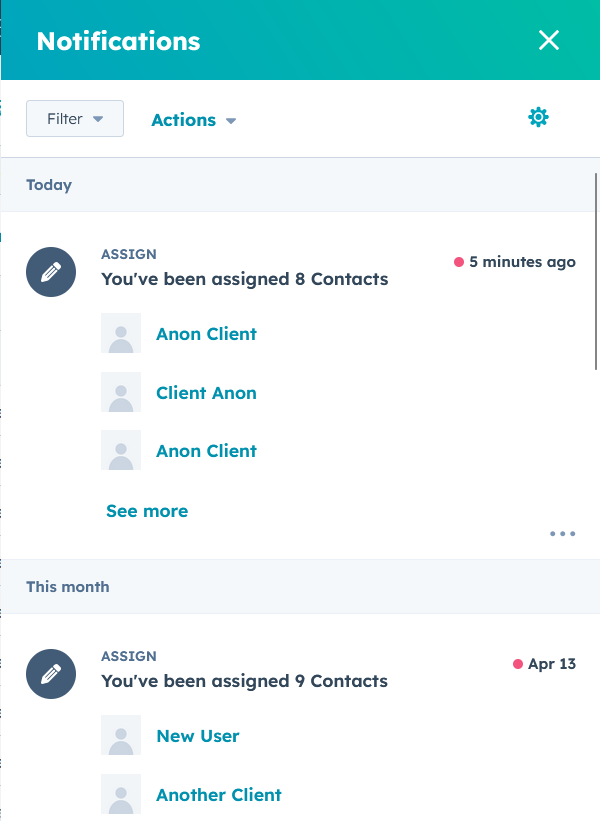

# 🏀 Inner Drive Hoops: HubSpot Auto-Registration Script

A Python-based automation tool that scrapes registration emails, extracts client data, and updates HubSpot CRM accordingly — streamlining marketing contact creation and mostly eliminating manual data entry.

Used weekly in production since late 2024, this script transformed hours of grunt work into ~90 seconds of effort per week.

---

## 📌 What It Does

- Connects to an IMAP inbox and scans for new registration emails  
- Parses registration content and creates structured `Contact` objects  
- Automatically cross-references contacts in HubSpot CRM  
- Adds or updates contact records, supporting:
  - Adult vs child registration logic  
  - Group tagging (clinics, camps, events)  
  - Address, phone, birthdate, and membership status fields  
- Offers an **interactive manual mode** for data review and updates  
- Logs unrecognized groups to a `.txt` file for manual follow-up  

---

## Samples

Creating a new contact

Previously created contacts showing up in Hubspot (names edited)
 

Updating existing client info

 
---

## ⚙️ Tech Stack

- Python 3.x  
- [`imapclient`](https://pypi.org/project/IMAPClient/) for email parsing  
- `email`, `datetime`, and `dateutil` for content formatting and timing  
- [`hubspot-api-client`](https://github.com/HubSpot/hubspot-api-python) for CRM integration  
- Python `dataclasses` for structured contact modeling  

---

## 🚀 Why It Matters

This script was designed to solve a real business problem at a growing sports facility — and it's been running in a live production workflow for months. It’s robust, practical, and built for scale.

---

## 🙋‍♂️ About the Author

Built and maintained by **Christopher Cottone**.  
Used in production at **Inner Drive Hoops** to streamline client onboarding and marketing workflows.

📫 [Email Me](mailto:chriscottone1@gmail.com.com)  
💼 [LinkedIn](https://www.linkedin.com/in/christopher-cottone-b9820928a/?trk=opento_sprofile_topcard)  

Currently seeking **junior/entry-level roles** in software development, automation, or technical support. Looking to build and learn as much as I can!
